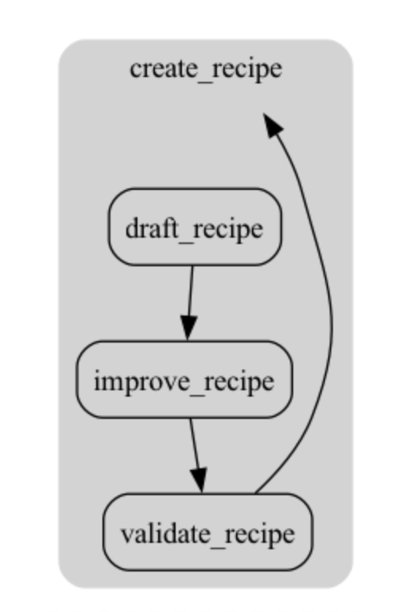

# Agent Steps

Agent Steps is a work-in-progress, experimental library for building LLM agent workflows and chains. It isn't ready for production use.

It lets you write LLM agent workflows using normal Python code, without needing to use an explicit DSL (e.g. creating graphs or explicit chains), while still being able to leverage a runtime layer that can provide controllability, persistence, introspection, and other tooling.

You write code like normal but can have the features of an agent framework through the use of a [Runtime](#running-workflows).

Writing ordinary, non-DSL Python code can be more natural than writing graph-oriented code, and it can be easier to debug and reason about.

## Creating a workflow

Workflows can be created using normal Python functions (including conditionals and for loops), but are decorated with `@step`:

```python
@step(max_loops=3)
def create_recipe(query: str) -> Recipe:
    recipe = draft_recipe(query)
    improved_recipe = improve_recipe(recipe)

    if not validate_recipe(improved_recipe).is_valid:
        # loop back and try again, up to max_loops
        return create_recipe(query)
    else:
        return improved_recipe
```

A workflow step can call other steps as well as normal functions, and it can also call itself or other steps cyclically.

## LLM calls

Steps that call LLMs are decorated with `@step(model="...")`, where the model parameter is a string that specifies the model to use for that step. The return value of the decorated function is a user prompt message, while any docstring is used as the system prompt, taking inspiration from [ell](https://github.com/MadcowD/ell):

```python
@step(model="gpt-4o-mini", temperature=0.75)
def draft_recipe(query: str) -> Recipe:
    """You are an inventive chef who is here to help a home cook create a recipe based on a query"""
    return query
```

The return type annotation is used as the output schema for the LLM call.

## Running workflows

To run the pipeline, a Runtime is provided as context, and then the root step is called as a normal function:

```python
with Runtime():
    create_recipe("chicken parmesan")
```

The runtime manages the execution of steps, keeps track of the results, and provides a logging function. In the future, it can provide callbacks, tooling, and other controllability features.

## Visualizing workflows

The graph of steps (statically, rather than at runtime) can be visualized using `graph_to_dotviz`:

```python
from agent_steps import graph_to_dotviz, make_graph

graph = make_graph(create_recipe, module)
dot = graph_to_dotviz(graph)
dot.render("test_graphviz", format="png")
```

 

## Dependencies

Currently the library depends on [Pydantic](https://docs.pydantic.dev/latest/) for schema and [LiteLLM](https://docs.litellm.ai/) for calling LLMs, as well as [Graphviz](https://graphviz.org/) for visualization.

## Roadmap

- [ ] Support streaming, liking using standard asyncio
- [ ] Turn a Union into tool calls
- [ ] Easy patterns for running steps in parallel
- [ ] Callbacks
- [ ] Persistence
- [ ] Integration with observability tools such as LangSmith and Weave

## Example

```python
from typing import Optional

from pydantic import BaseModel

from agent_steps import step, Runtime


class Recipe(BaseModel):
    description: str
    ingredients: list[str]
    instructions: list[str]
    tips: list[str]


@step(model="gpt-4o-mini")
def draft_recipe(query: str) -> Recipe:
    """You are an inventive chef who is tasked with creating a recipe based on a query"""
    return query


@step(model="gpt-4o-mini")
def improve_recipe(recipe: Recipe) -> Recipe:
    """You are a chef who is very detailed and great at improving recipes. Please return an improved version of the recipe"""
    return recipe


class ValidationResult(BaseModel):
    is_valid: bool
    reason: Optional[str] = None


@step(model="gpt-4o-mini")
def validate_recipe(recipe: Recipe) -> ValidationResult:
    """Please consider if this recipe is valid, according to whether it would be easy for a home cook to follow"""
    return recipe


@step(max_loops=3)
def create_recipe(query: str):
    recipe = draft_recipe(query)
    improved_recipe = improve_recipe(recipe)

    if not validate_recipe(improved_recipe).is_valid:
        return create_recipe(query)

    return improved_recipe


with Runtime():
    create_recipe("chicken parmesan")
```
